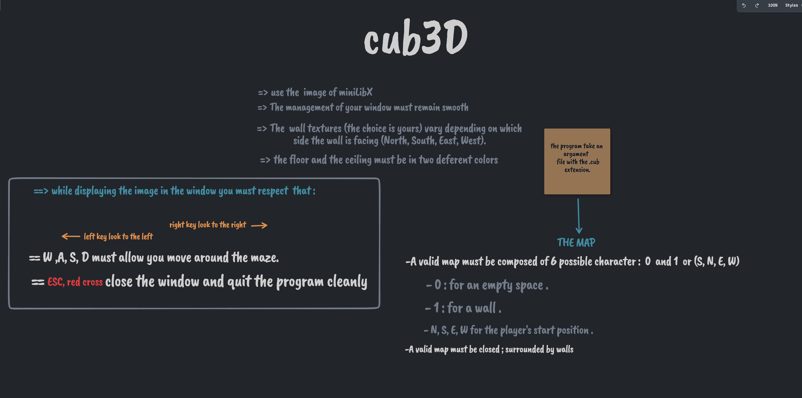

# Cub3D

## Getting started

### run on MacOS

```bash
make && ./cub3D
```

### run on Linux

**[Follow linux installation guide](https://harm-smits.github.io/42docs/libs/minilibx/getting_started.html#installation)**

```bash
export MLX_PATH=/path/to/mlx_linux

make -f MakefileLinux && ./cub3D
```


